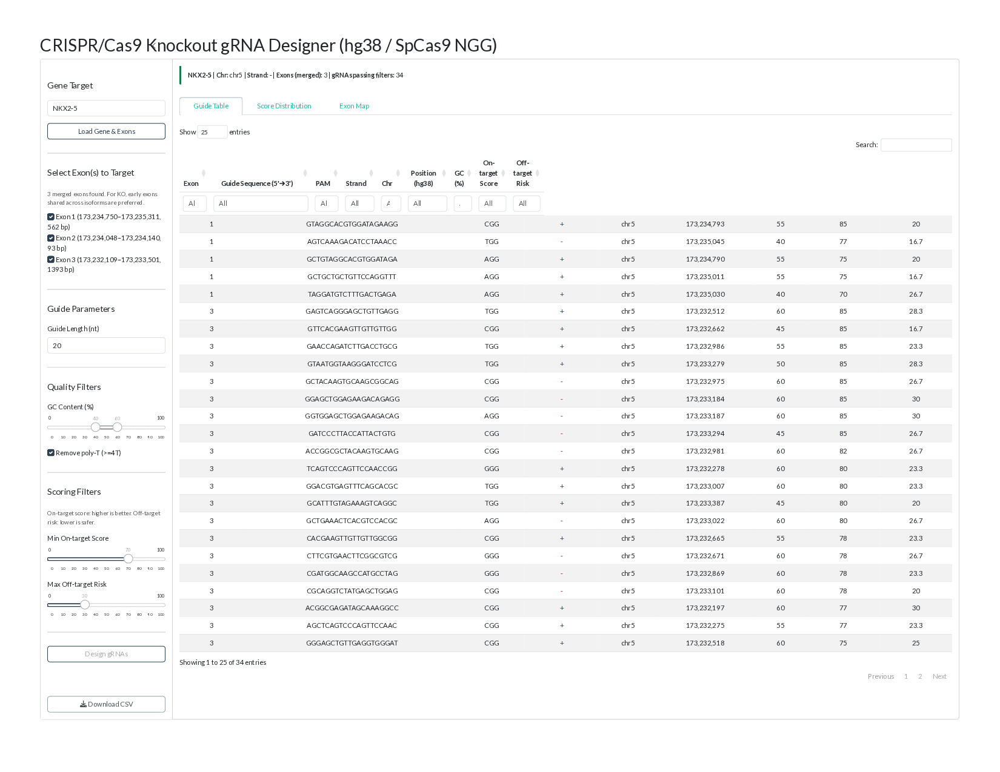
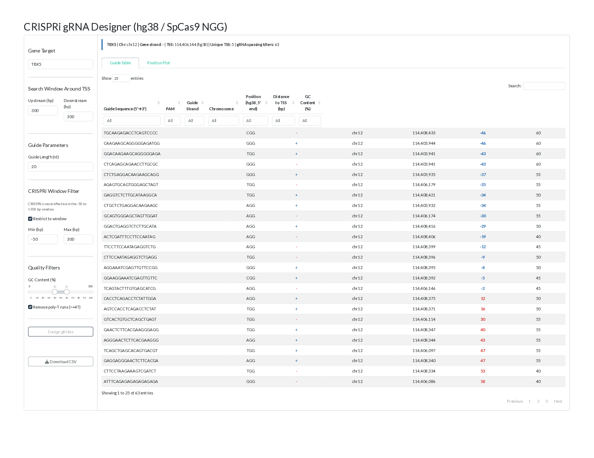
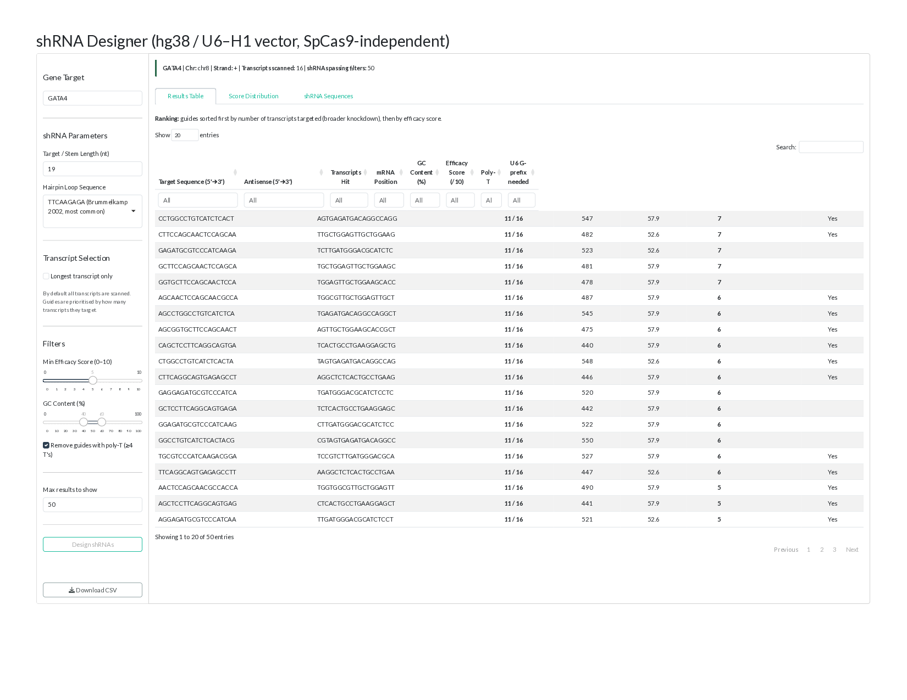
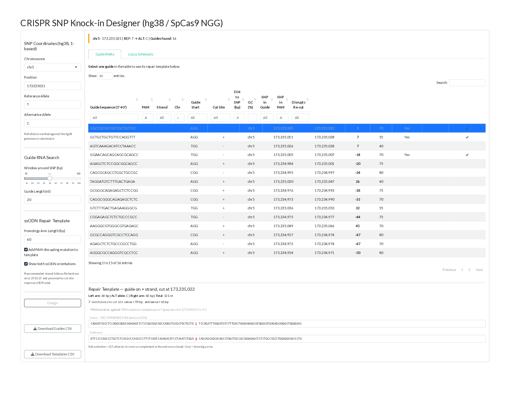

# gRNA/shRNA Designer

A suite of R/Shiny apps for designing CRISPR and RNAi reagents directly from a gene symbol or genomic coordinate, using the **hg38** reference genome. Each app scans the relevant genomic region, scores every candidate guide/hairpin, and returns a ranked, ready-to-order design table.

This page is a static screenshot tour of the apps — no live R server required. To run the apps yourself, see the [source code](#source-code) below.

## 1. CRISPR/Cas9 Knockout gRNA Designer

Takes a gene symbol, pulls its merged exons from hg38, and scans user-selected exons for every SpCas9 guide (NGG PAM) — scoring each for on-target efficiency and off-target risk so the strongest frameshift-KO candidates surface first.

*Input panel (gene target, exon selection, GC/score filters) alongside the results table of candidate guides ranked by on-target score and off-target risk, for gene NKX2-5.*

## 2. CRISPRi Knockdown gRNA Designer

Locates a gene's TSS in hg38, scans the promoter window on both strands for guides, and reports signed distance-to-TSS for each — flagging the −50 to +300 bp zone where CRISPRi silencing is most effective.

*Input panel for the TSS search window and guide parameters, next to the results table showing each guide's position and signed distance to the TSS, for gene TBX5.*

## 3. Gene Knockdown shRNA Designer

Scans every annotated transcript of a gene for candidate siRNA target sites, scores each by Reynolds/Schwarz-Khvorova design rules (GC content, thermodynamic asymmetry, cleavage-site A/U), and returns a ready-to-clone U6/H1 hairpin.

*Input panel (target/stem length, hairpin loop sequence, transcript selection, efficacy/GC filters) with the results table of candidate shRNA target sites ranked by transcripts hit and efficacy score, for gene GATA4.*

## 4. CRISPR SNP Knock-in Designer

Given a single-nucleotide edit (chr:pos, ref → alt), verifies the reference allele against hg38, ranks nearby guides by cut-site distance, and auto-builds an ssODN repair template — with an optional PAM-disrupting mutation to block re-cutting.

*Input panel (SNP coordinates, reference/alternative allele, ssODN homology arm length) with the ranked guide table and the auto-generated sense/antisense ssODN repair templates for the selected guide.*

## Source Code

- [`app1_CRISPR_KO_gRNA.R`](../app1_CRISPR_KO_gRNA.R) — CRISPR/Cas9 Knockout gRNA Designer
- [`app2_CRISPRi_KD_gRNA.R`](../app2_CRISPRi_KD_gRNA.R) — CRISPRi Knockdown gRNA Designer
- [`app4_gene_KD_shRNA.R`](../app4_gene_KD_shRNA.R) — Gene Knockdown shRNA Designer
- [`app3_CRISPR_KO_SNP_knockin.R`](../app3_CRISPR_KO_SNP_knockin.R) — CRISPR SNP Knock-in Designer

Full repository: [github.com](../)
